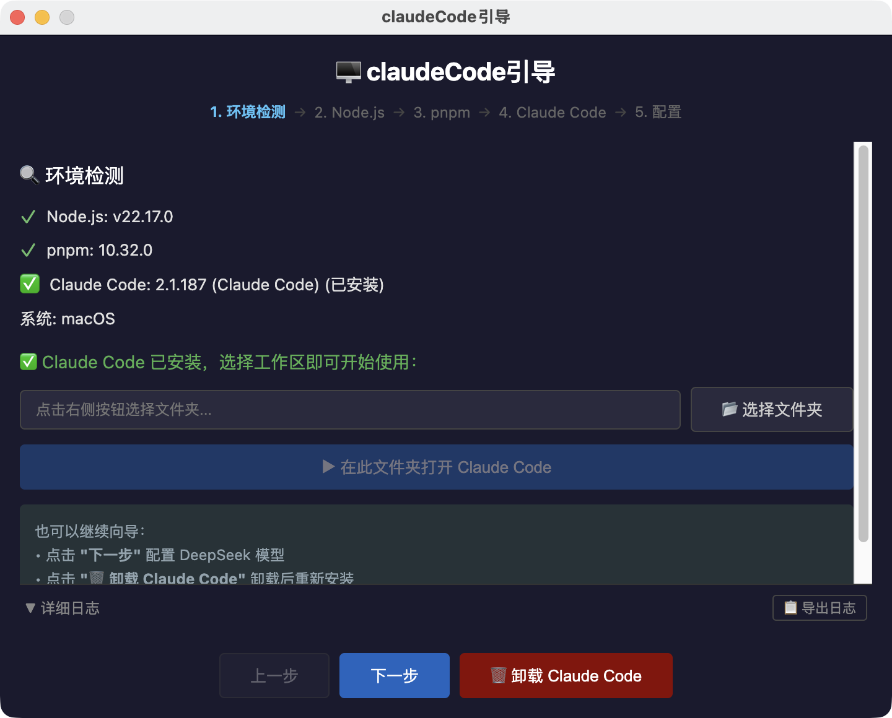
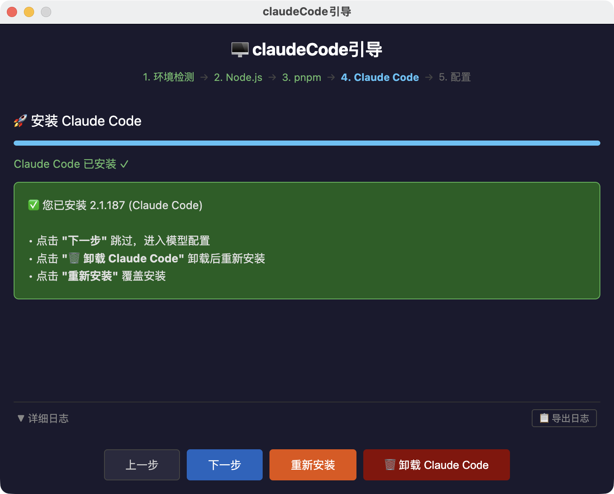
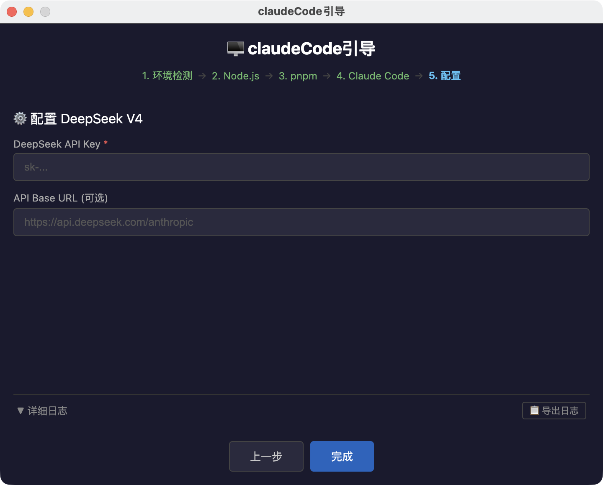

# claudeCode引导

一键安装 [Claude Code](https://claude.ai/code) 的跨平台桌面工具。自动检测系统环境，安装 Node.js / pnpm，安装 Claude Code 并配置 DeepSeek 模型。支持 macOS 和 Windows。

---

## 功能

- **环境检测** — 检查 Node.js、pnpm、Claude Code 是否已安装
- **已安装即用** — 检测到 Claude Code 已安装时，可直接选工作区并打开终端启动
- **安装 Node.js** — 从 Node.js 官方源下载对应架构版本并静默安装
- **安装 pnpm** — 通过 npm 全局安装
- **安装 Claude Code** — Windows 用 npm + 国内镜像，macOS 用 pnpm
- **卸载 Claude Code** — 支持一键卸载
- **配置 DeepSeek** — 写入 `~/.claude.json` + `~/.claude/settings.json`
- **系统 PATH 配置**（Windows）— 自动将 npm 全局路径写入系统 PATH
- **系统兼容检测** — Windows 10 用户会收到升级/WSL2 建议
- **全流程日志** — 每个操作实时日志，支持导出为 txt 文件
- **安装保护** — 安装过程中关闭窗口会弹出确认提示

---

## 技术栈

| 层 | 技术 |
|---|------|
| 框架 | Electron |
| 主进程 | TypeScript |
| 渲染进程 | 原生 HTML/CSS/JS |
| 测试 | Vitest（9 个测试文件，35 个用例） |
| 打包 | electron-builder |

---

## 安装依赖

```bash
pnpm install
```

> `.npmrc` 已配置国内镜像，国内网络直接安装即可。
> 安装 electron 二进制需要 `pnpm.approveBuilds` 或 `pnpm.onlyBuiltDependencies` 配置（`package.json` 已配好）。

---

## 开发

```bash
# 运行测试
pnpm test

# 启动应用（编译 + 运行，无热更新）
pnpm dev
```

---

## 构建

```bash
pnpm build
```

macOS / Windows 通用，脚本自动检测平台。构建产物输出到 `release/`：

| 平台 | 产物 |
|------|------|
| macOS | `.dmg` + `.zip` |
| Windows | `.zip` |

---

## 使用方式

**向导流程（5 步）：**
1. **环境检测** — 显示 Node.js、pnpm、Claude Code 安装状态
2. **Node.js** — 未安装则自动下载对应架构版本并安装
3. **pnpm** — 通过 npm 全局安装
4. **Claude Code** — 已安装则直接跳过；未安装则自动安装
5. **配置模型** — 输入 DeepSeek API Key，填入可选的自定义 API 地址

**已安装场景：**
Step 1 检测到 Claude Code 已安装时，可直接选择工作区文件夹 → 自动打开终端启动 `claude`。

**卸载：**
Step 4（安装页）提供 **🗑 卸载 Claude Code** 按钮，确认后执行卸载。

**错误恢复：**
安装失败时显示 **重试** 按钮，Node.js/pnpm 安装失败可 **跳过**。

---

## 界面截图







---

## 平台差异

| | macOS | Windows |
|---|-------|---------|
| Claude Code 安装命令 | `pnpm install -g` | `npm install -g --registry https://registry.npmmirror.com` |
| Claude Code 卸载命令 | `pnpm uninstall -g` | `npm uninstall -g` |
| Node.js 格式 | `.pkg`（`sudo installer`） | `.msi`（`msiexec /i /quiet`） |
| Shell | `/bin/zsh` | `cmd.exe` |
| PATH 处理 | 无需 | 自动写入系统 PATH（需管理员权限） |
| 兼容检测 | 无 | Win10 提示升级/WSL2 |
| 终端启动 | `osascript` + Terminal | `start "Claude Code" cmd /k` |

---

## 参考资源

- [Claude Code 指令速查表](https://banwagong1.com/claude-code.html) — 在线版
- `Claude Code 速查表.pdf` — 离线版（项目根目录）

---

## 项目结构

```
cc_install/
├── package.json
├── electron-builder.yml
├── tsconfig.json
├── vitest.config.ts
├── .npmrc                     # 国内镜像配置
├── scripts/
│   └── build.js               # 跨平台构建脚本
├── assets/
│   └── icon.png               # 应用图标 (1024×1024)
├── src/
│   ├── main/                  # Electron 主进程 (TypeScript)
│   │   ├── index.ts           # 窗口管理 + 关闭保护
│   │   ├── ipc-handlers.ts    # IPC 通道注册
│   │   ├── logger.ts          # 全局日志系统
│   │   ├── modules/
│   │   │   ├── env-check.ts       # 环境检测 (node / pnpm / claude)
│   │   │   ├── node-install.ts    # Node.js 下载安装
│   │   │   ├── pnpm-install.ts    # pnpm 安装
│   │   │   ├── cc-install.ts      # Claude Code 安装 + PATH 配置
│   │   │   ├── cc-uninstall.ts    # Claude Code 卸载
│   │   │   ├── config-gen.ts      # DeepSeek 配置生成
│   │   │   └── workspace.ts       # 工作区选择 + 终端启动
│   │   └── utils/
│   │       ├── platform.ts    # 平台/架构检测 + 兼容检查
│   │       ├── shell.ts       # 跨平台子进程封装
│   │       └── download.ts    # 下载（重试 + 进度回调）
│   ├── preload/index.ts       # contextBridge API
│   └── renderer/              # 渲染进程 (HTML/CSS/JS)
│       ├── index.html
│       ├── style.css
│       ├── app.js             # 向导状态机
│       └── steps/             # 5 个步骤页面
└── docs/
    ├── img/                   # 截图
    ├── superpowers/specs/     # 设计文档
    └── superpowers/plans/     # 实现计划
```

---

## License

MIT
